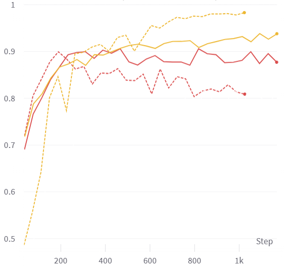
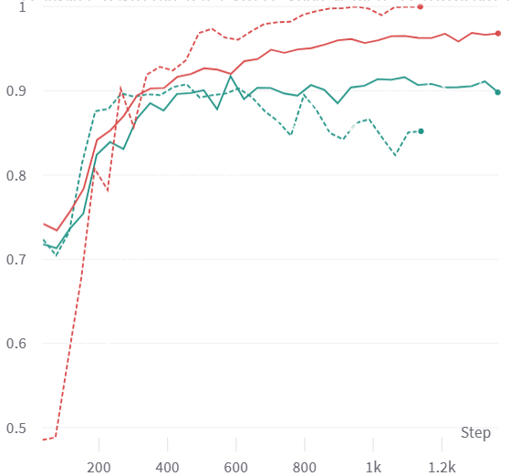
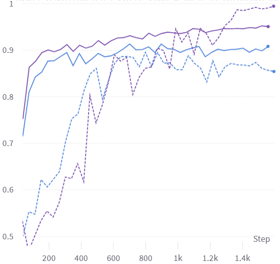

# PseMix

Pseudo-Bag Mixup Augmentation for Multiple Instance Learning-Based Whole Slide Image Classification. [Preprint](https://arxiv.org/abs/2306.16180)

## Implementations

For simplicity, we show our pseudo-codes of PseMix as follows:
```python
# generate_pseudo_bags: function for dividing WSI bags into pseudo-bags
# ALPHA: the hyper-parameter of Beta distribution
# N: the number of pseudo-bags in each WSI bag
# PROB_MIXUP: random mixing parameter for determining the proportion of mixed bags. 
for (X, y) in loader: # load a minibatch 
    n_batch = X.shape[0] # with `n_batch` WSI bags (samples)

    # divide each bag into `N` pseudo-bags
    X = generate_pseudo_bags(X)

    # index for the mixing of each bag pair
    new_idxs = torch.randperm(n_batch)

    # pseudo-bag-level Mixup
    # 1. draw a mixing scale from Beta distribution
    lam = numpy.random.beta(ALPHA, ALPHA) 
    lam = min(lam, 1.0 - 1e-5) # avoid numerical overflow when transforming it into discrete ones
    lam_discrete = int(lam * (N + 1)) # transform into discrete values

    # 2. pseudo-bag mixing
    new_X, new_y = [], []
    for i in range(n_batch):
    	# randomly select pseudo-bags according to `lam_discrete`
        masked_bag_A = select_pseudo_bags(X[i], lam_discrete) # select `lam_discrete` pseudo-bags
        masked_bag_B = select_pseudo_bags(X[new_idxs[i]], N - lam_discrete) # select `n-lam_discrete` pseudo-bags

        # random-mixing mechanism for two purposes: more data diversity and efficient learning on mixed samples.
        if np.random.rand() <= PROB_MIXUP:
            mixed_bag = torch.cat([masked_bag_A, masked_bag_B], dim=0) # instance-axis concat
            new_X.append(mixed_bag)
            mix_ratio = lam_discrete / N
        else:
            masked_bag = masked_bag_A 
            new_X.append(masked_bag)
            mix_ratio = 1.0

        # target-level mixing
        new_y.append(mix_ratio * y[i] + (1 - mix_ratio) * y[new_idxs[i]]) 

    # 3. minibatch training
    minibatch_training(new_X, new_y)
```

NOTE that we actually use a weighted loss for target mixing, following [Mixup implementation](https://github.com/facebookresearch/mixup-cifar10). Details could be found at [the weighted loss](https://github.com/liupei101/PseMix/blob/main/model/clf_handler.py#L407).

Our implementation roughly follows the pseudo-codes above. Details could be found by:

- **Pseudo-bag dividing**: https://github.com/liupei101/PseMix/blob/main/utils/core.py#L146C13-L146C13
- **Pseudo-bag-level Mixup**: https://github.com/liupei101/PseMix/blob/main/utils/core.py#L13C10-L13C10
- **Training with mixed labels**:  https://github.com/liupei101/PseMix/blob/main/model/clf_handler.py#L381

## Training with PseMix

Training curves (training and test AUC, exported from wandb) are as follows. Solid lines indicate training with PseMix, and dashed ones are those vanilla models without PseMix.   

| Model                                                                  | Wandb training curves                                  |
|------------------------------------------------------------------------|--------------------------------------------------------|
| [ABMIL](https://proceedings.mlr.press/v80/ilse18a.html)                |          |
| [DSMIL](https://openaccess.thecvf.com/content/CVPR2021/papers/Li_Dual-Stream_Multiple_Instance_Learning_Network_for_Whole_Slide_Image_Classification_CVPR_2021_paper.pdf)         |    |
| [TransMIL](https://openreview.net/forum?id=LKUfuWxajHc)     |        |

Any issues are welcomed. 
